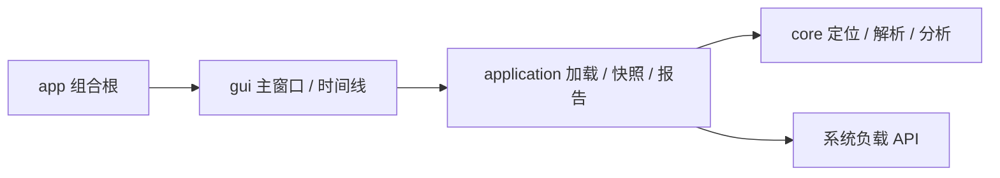
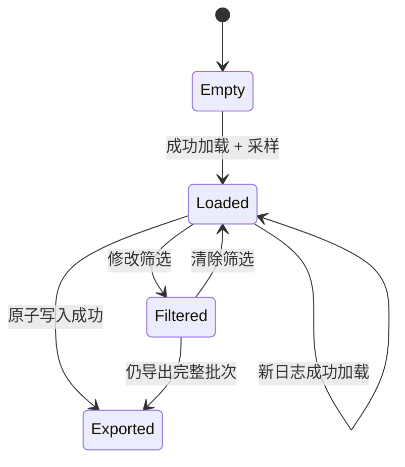
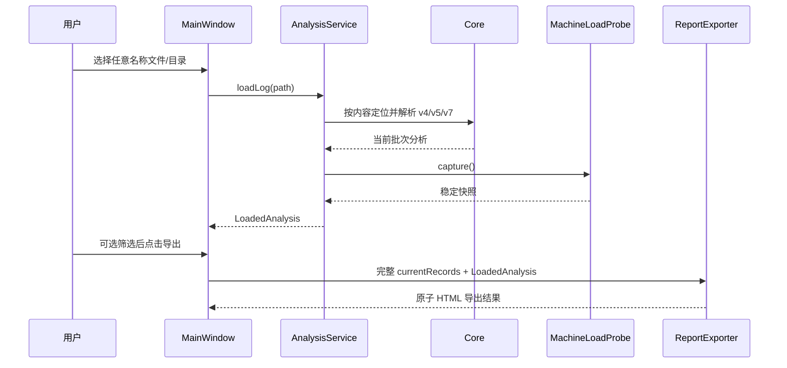

# 设计文档：ninja-log-analysis-enhancements

> 阶段：design
>
> 工作流：requirements-first
>
> 设计深度：high
>
> 状态：草案
>
> 最近更新：2026-07-24

## 设计摘要

- 目标：在不改变现有四层依赖方向的前提下，完整交付六项日志分析增强。
- 覆盖行为：REQ-001、REQ-002、REQ-003、REQ-004。
- 核心方案：core 做格式与内容识别；application 持有稳定机器快照并生成原子 HTML 报告；gui 负责入口、滚动和解释。
- 模块/构建边界：ARCH-001–ARCH-004 / BUILD-001–BUILD-002。

## 代码库调查

| 证据类型 | 证据 | 已验证事实 | 对设计的影响 |
|---|---|---|---|
| 用户 | 2026-07-24 六项需求及“感觉这些都没有实现” | 当前可见版本确实无这些行为 | 以当前 `main` 为唯一实现基线 |
| 仓库 | `src/core/NinjaLogParser.cpp`、`LogLocator.cpp` | 只支持 v4/v5 且限制文件名 | 改动归 core |
| 仓库 | `src/application/AnalysisService.*` | 加载结果是 UI 的稳定应用契约 | 快照加入 `LoadedAnalysis` |
| 仓库 | `src/gui/MainWindow.*`、`TimelinePage.*`、`TimelineWidget.*` | UI 已分层，滚动容器存在但内容高度不更新 | 只做定向 GUI 扩展 |
| 结构基线 | `inspect_structure.py` 与 CMake | `app → gui → application → core` | 不新增反向依赖 |

### 工具链与兼容性基线

| 项目 | 已验证值 | 证据 | 设计结论 |
|---|---|---|---|
| OS/架构 | Darwin 24.6.0 arm64 | `uname -srm` | 本机完成原生 macOS 验证 |
| 构建系统 | CMake 3.27.1 | `cmake --version` | 沿用现有 CMake 模块 |
| Qt | 5.15.2 / 6.4.3 | 已完成架构 Spec 记录、现有 CI/本机构建约定 | 所有 API 写 Qt5/Qt6 兼容分支 |
| 交付 | `<build>/bin/Ninja Log Analyzer.app` | `src/app/CMakeLists.txt` | 不改变 bundle 身份和路径 |

## 约束与设计原则

- 报告与 UI 必须共享同一份应用数据，不从 QWidget 抓取文本拼报告。
- 定位器只做有界签名识别；严格版本和记录合法性仍由解析器负责。
- 机器负载快照是上下文，不参与耗时评分，不伪装成构建时遥测。
- UI 筛选只影响可视记录，完整报告始终读取当前批次的未筛选记录。
- 不引入网络、数据库、模板引擎或新第三方库。

## 方案比较

| 方案 | 需求覆盖 | 优点 | 代价与风险 | 结论 |
|---|---|---|---|---|
| A：core/application/gui 分层实现 | 全部 | 可测试、报告与 UI 数据一致、依赖方向稳定 | 新增少量应用层类型 | 采用 |
| B：全部写入 `MainWindow` | 表面覆盖 | 初始改动少 | 无法独立测试、职责膨胀、报告易受筛选影响 | 否决 |
| C：保存页面截图作为报告 | 部分 | 所见即所得 | 不完整、不可检索、无法覆盖滚动外数据 | 否决 |

### DEC-001：按内容签名定位，解析器严格判版

- 上下文与需求：REQ-001。
- 决策：`LogLocator` 对直接文件和递归候选最多读取 128 字节，首行匹配 `# ninja log v<整数>` 即视为候选；`NinjaLogParser` 仅接受 4/5/7。
- 理由：支持重命名和未来版本的清晰错误，同时避免目录扫描读取整文件。
- 代价：目录中的任意签名文件都可能成为候选；通过规范化路径排序保证确定性。
- 被否决方案：扩展名白名单；仍会拒绝用户分类后的日志。

### DEC-002：泳道高度由数据驱动

- 上下文与需求：REQ-002。
- 决策：`TimelineWidget::setRecords()` 重算泳道后，用 `sizeHint()` 更新 minimum height 并触发布局；`QScrollArea` 保持 widget-resizable 与垂直按需滚动。
- 理由：利用现有滚动容器，保证增长和收缩都能反映。
- 代价：记录变化会重新布局，规模与当前算法一致。
- 被否决方案：把泳道压缩到核心数；会产生遮挡并传达错误含义。

### DEC-003：应用层生成自包含 HTML 报告

- 上下文与需求：REQ-003。
- 决策：新增值类型 `AnalysisReportRequest/Result` 和无 UI 依赖的 `AnalysisReportExporter`，使用 `QSaveFile` 原子写 UTF-8 HTML。
- 理由：GUI 只负责选择路径与反馈；导出逻辑可单测并复用。
- 代价：需要显式组织所有报告字段和 Qt5/Qt6 编码差异。
- 被否决方案：从界面控件提取文本；会漏掉筛选外数据和滚动外内容。

### DEC-004：成功加载时采集一次机器快照

- 上下文与需求：REQ-004。
- 决策：application 新增 `MachineLoadSnapshot/Probe`；`AnalysisService::loadLog()` 成功后采样，存入 `LoadedAnalysis`。
- 理由：UI 与报告使用同一快照，筛选不改变上下文。
- 代价：它只能代表分析时机器；UI 与报告必须反复强调限制。
- 被否决方案：定时轮询；增加状态和噪声，仍无法恢复构建时负载。

## 总体架构

### 组件与职责

| 组件 | 职责与边界 | 输入/输出 | 相关需求 |
|---|---|---|---|
| `LogLocator` | 有界内容签名探测和确定性候选选择 | 路径 → `LocateResult` | REQ-001 |
| `NinjaLogParser` | v4/v5/v7 严格解析 | 日志路径 → `ParseResult` | REQ-001 |
| `MachineLoadProbe` | 一次性采集系统上下文 | 无 → `MachineLoadSnapshot` | REQ-004 |
| `AnalysisService` | 编排定位、解析、分析和快照 | 输入路径 → `LoadedAnalysis` | REQ-001, REQ-004 |
| `AnalysisReportExporter` | 验证请求并原子生成 HTML | 报告请求 → 结果 | REQ-003, REQ-004 |
| `TimelineWidget/Page` | 泳道布局、滚动尺寸、解释 | 记录/批次 → 可视时间线 | REQ-002 |
| `MainWindow` | 选择、状态、筛选、保存交互 | 用户事件 → UI/文件 | REQ-001–REQ-004 |

## 模块与依赖边界

### ARCH-001：保持单向四层依赖

- 决策：`app → gui → application → core`；OS 采集由 application 内部适配。
- 组合根：`src/app/main.cpp` 与 `src/app/CMakeLists.txt`。
- 禁止的跨层依赖：core/application 不得依赖 Qt Widgets；报告导出器不得读取 GUI 控件；core 不得调用 application。
- 边界验证方法：CMake target 链接检查、两套 Qt 构建。

### ARCH-002：核心层拥有日志事实

- 决策：版本支持、内容签名和记录字段语义全部属于 core。
- 边界：core 公开 `LocateResult`、`ParseResult` 和日志值类型，不公开文件选择 UI。

### ARCH-003：应用层拥有稳定分析上下文

- 决策：`LoadedAnalysis` 扩展机器快照；报告请求仅包含值和 const 数据，不包含 QWidget。
- 边界：平台 API 条件编译与 HTML 原子写入均封装在 application。

### ARCH-004：表现层只拥有交互与可视状态

- 决策：`filteredRecords_` 仅供可视时间线，`currentRecords_`/`currentAnalysis_` 供报告。
- 边界：文件对话框、按钮状态、消息框、滚动条和解释文案属于 gui。

| 模块/层 | 单一主要职责 | 公开契约/数据所有权 | 允许依赖 | 禁止依赖 | 目录/测试所有权 |
|---|---|---|---|---|---|
| core | 日志定位、解析、分析 | 日志/分析值类型 | Qt Core | application/gui | `src/core` / `tst_core` |
| application | 用例编排、环境快照、报告 | `LoadedAnalysis`、报告请求/结果 | core、Qt Core、OS API | Qt Widgets/gui | `src/application` / `tst_application` |
| gui | 用户交互与绘制 | QWidget 状态 | application、Qt Widgets | app 组合细节 | `src/gui` / `tst_mainwindow` |
| app | 可执行与 bundle | 启动入口/资源 | gui | 业务实现 | `src/app` / bundle 验证 |

## 构建与交付结构

### BUILD-001：沿用模块就近构建单元

- 已确认构建系统及版本：CMake 3.27.1。
- 顶层入口仅负责：项目配置、Qt 查找、子目录与测试开关。
- 模块就近声明：新增 `.cpp/.h` 分别加入 application 或既有 target。
- 可复用规则/约定插件：沿用 `cmake/ProjectOptions.cmake` 严格警告。
- 资源、安装、签名、部署/发布责任：仍由 `src/app` 和既有 bundle 脚本负责。

| 构建单元/Target | 类型 | 所有模块 | 公开依赖 | 私有依赖 | 定义位置 | 验证单元 |
|---|---|---|---|---|---|---|
| `ninja_analyzer_core` | 静态库 | locator/parser/analyzer | Qt Core | 无 | `src/core/CMakeLists.txt` | `tst_core` |
| `ninja_analyzer_application` | 静态库 | service/load probe/report | core、Qt Core | OS libc | `src/application/CMakeLists.txt` | `tst_application` |
| `ninja_analyzer_gui` | 静态库 | main/timeline/pages | application、Qt Widgets | core | `src/gui/CMakeLists.txt` | `tst_mainwindow` |
| `NinjaLogAnalyzer` | MACOSX_BUNDLE/可执行 | composition | gui | Qt runtime | `src/app/CMakeLists.txt` | bundle/启动验证 |

### BUILD-002：交付契约不变

- macOS 开发/交付路径：`<build>/bin/Ninja Log Analyzer.app`。
- bundle 版本、图标、Frameworks/PlugIns 部署方式沿用 0.2.0 现有契约。
- Windows/Linux 本次只维持源码条件编译和 Qt API 兼容，不宣称已生成原生安装包。

## 平台与交付矩阵

| 目标平台/架构 | 开发构建物及精确路径 | 安装/部署产物 | 最终发布包 | 运行时依赖与资源 | 原生验证命令/证据 |
|---|---|---|---|---|---|
| macOS arm64 | `<build>/bin/Ninja Log Analyzer.app` | 自包含 `.app` | `.app` | Qt Frameworks/PlugIns/Resources | CTest、bundle 脚本、启动 |
| Windows | `<build>/bin/NinjaLogAnalyzer.exe`（源码契约） | 本次不产出 | 不适用 | Qt DLL/平台插件由既有部署负责 | 当前无原生 runner，记录限制 |
| Linux | `<build>/bin/NinjaLogAnalyzer`（源码契约） | 本次不产出 | 不适用 | Qt so/平台插件由既有部署负责 | 当前无原生 runner，记录限制 |

## 复杂度预算与演进规则

| 维度 | 当前基线 | 边界/触发条件 | 触发后动作 | 验证方式 |
|---|---|---|---|---|
| `MainWindow.cpp` | 约 359 行 | 新增导出渲染逻辑会显著膨胀 | HTML 生成必须留在 application | 行数/职责审查 |
| 报告导出器 | 新文件 | 超过单一 HTML 报告职责或多格式 | 再拆模板/格式适配器 | 单测 |
| 模块依赖 | 四层单向 | 出现 application→gui | 拒绝并重设契约 | CMake |
| 顶层 CMake | 约 38 行 | 新增业务源文件 | 必须模块就近声明 | diff 审查 |
| 测试所有权 | core/application/gui 分层 | 跨层行为无对应验证 | 放到最接近契约的测试 target | CTest |

## 接口契约

| 接口/事件 | 请求或输入 | 响应或副作用 | 错误语义 | 兼容性 |
|---|---|---|---|---|
| `LogLocator::resolve` | 文件/目录路径 | 确定日志路径 | 空、不可读、无签名 | 保持现有返回类型 |
| `NinjaLogParser::parse` | 日志路径 | v4/v5/v7 记录 | 不支持版本/非法字段 | v4/v5 回归 |
| `MachineLoadProbe::capture` | 无 | 稳定值快照 | 指标不可用而非整体失败 | 类 Unix/降级 |
| `AnalysisService::loadLog` | 输入路径 | `LoadedAnalysis` + snapshot | 原有加载错误 | 扩展值类型 |
| `AnalysisReportExporter::exportHtml` | path + loaded/current records | 成功结果和写入文件 | 空路径/打开/提交错误 | Qt5/Qt6 |
| `MainWindow::exportReportTo` | 输出路径、交互标志 | 写入并按需反馈 | 无分析/导出失败 | 便于 GUI 测试 |

## 数据模型与状态

- `LogRecord::hasCommandHash` 表示 v5/v7 的哈希字段有效；从 `hasV5Hash` 迁移并更新所有引用。
- `MachineLoadSnapshot`：`capturedAtUtc`、`logicalProcessorCount`、`kernelType`、`kernelVersion`、`cpuArchitecture`、`loadAverageAvailable`、`loadAverage1/5/15`。
- `LoadedAnalysis`：现有 `logPath/parsed/analysis` 加 `machineLoad`。
- `AnalysisReportRequest`：输出路径、`LoadedAnalysis` 引用/副本、当前批次完整记录。
- 生命周期：每次成功加载替换当前分析与快照；筛选只替换可视列表；失败加载不得形成新可导出状态。

## 关键流程

## 算法与伪代码

### 内容签名

1. 打开常规文件为只读，读取最多 128 字节。
2. 截取第一行，去除 CR/LF，仅接受完整正则 `^# ninja log v[0-9]+$`。
3. 直接文件匹配则返回；目录递归遍历常规文件，规范化路径排序后返回第一个匹配项。
4. 解析器提取版本；仅 4/5/7 继续，其他版本返回明确错误。

### 泳道分配与高度

1. 按开始/结束时间排序记录。
2. 将记录放入第一个 `laneEnd <= record.start` 的泳道，否则新建泳道。
3. 内容高度 = 上边距 + `max(1, laneCount) * laneHeight` + 下边距。
4. `setMinimumHeight(sizeHint().height())`、`updateGeometry()`；滚动区据此更新范围。

### 报告

1. 验证已有分析、路径非空、当前批次完整记录可用。
2. 所有动态文本统一 `toHtmlEscaped()`；数值经固定格式化函数输出。
3. 生成 head/CSS、元信息、摘要、分类、洞察、并发/负载说明、完整任务表。
4. 用 `QSaveFile` 写 UTF-8；仅 `commit()` 成功才返回成功。

## 错误处理与恢复

| 失败点 | 检测 | 处理/重试 | 用户可见结果 | 恢复 |
|---|---|---|---|---|
| 文件非日志 | 签名不匹配 | 不解析 | “未找到 Ninja 日志内容” | 重新选择 |
| 不支持版本 | 解析版本集合检查 | 不降级猜测 | 显示支持 v4/v5/v7 | 换日志 |
| load average 不可用 | 平台/API 返回失败 | snapshot 标记 unavailable | 显示不可用与限制 | 其他功能继续 |
| 报告路径不可写 | `QSaveFile::open/commit` | 不报告成功 | 错误消息含原因 | 另选路径 |
| 用户取消导出 | 空路径 | 静默返回取消 | 无成功弹窗 | 再次点击 |

## 非功能设计

- 安全与隐私：只本地读取/写入；动态内容 HTML 转义；报告可能包含目标路径，用户主动选择保存。
- 性能与容量：候选探测有界；解析和报告均 O(n)；不生成截图。
- 可观测性：状态栏显示实际日志路径、版本、行统计、泳道/快照摘要；错误可见。
- 兼容性：避免 Qt6-only API；文本编码用版本条件分支；`getloadavg` 按平台条件编译。
- 部署、迁移与回滚：无数据迁移；保持 bundle；回滚为移除新增应用服务和 UI 入口。

## 正确性属性

### PROP-001：支持版本集合精确

- 来源：REQ-001 / AC-001.1、AC-001.4。
- 属性：任意合法签名中，只有版本 4、5、7 被接受，且 5/7 的命令哈希语义一致。
- 验证：数据驱动单元测试。

### PROP-002：定位与文件名无关

- 来源：REQ-001 / AC-001.2–AC-001.5。
- 属性：相同内容在任意常规文件名下得到相同解析结果，探测不读取整文件。
- 验证：临时目录、重命名和尾部大数据测试。

### PROP-003：泳道都可达

- 来源：REQ-002 / AC-002.1–AC-002.2。
- 属性：对任意记录集合，内容高度覆盖所有已分配泳道；集合收缩后高度不大于新的 `sizeHint`。
- 验证：24 个重叠区间 GUI 测试和收缩测试。

### PROP-004：报告完整性不受筛选影响

- 来源：REQ-003 / AC-003.3–AC-003.4。
- 属性：任意 UI 筛选状态下，报告任务行数始终等于当前批次完整记录数。
- 验证：GUI 集成测试与 HTML 内容断言。

### PROP-005：快照一致且诚实降级

- 来源：REQ-004 / AC-004.2–AC-004.4。
- 属性：一次成功加载内 UI 与报告引用相同采集时间和值；不可用指标不会显示为数值 0。
- 验证：application/GUI 测试。

## 测试策略

| 行为/属性 | 测试层级 | 关键场景 | 证据形式 |
|---|---|---|---|
| REQ-001 / PROP-001/002 | core 单元 | v4/v5/v7、v6、坏 hash、任意名、混合目录、有界读取 | `tst_core` |
| REQ-004 / PROP-005 | application 单元 | snapshot 字段/可用性、load service 持有快照 | `tst_application` |
| REQ-003 / PROP-004 | application + GUI | HTML 完整、转义、失败、按钮状态、筛选后仍完整 | `tst_application`、`tst_mainwindow` |
| REQ-002 / PROP-003 | GUI | 24 重叠泳道滚动、缩小、说明文案 | `tst_mainwindow` |
| NFR-001/005/006 | 构建/交付 | Qt5、Qt6、严格警告、bundle runtime、启动 | CMake/CTest/脚本 |

## 需求覆盖矩阵

| 行为 | 组件/接口 | 架构/构建边界 | 决策 | 正确性属性 | 测试策略 |
|---|---|---|---|---|---|
| REQ-001 | Locator/Parser/Service | ARCH-001/002, BUILD-001 | DEC-001 | PROP-001/002 | core/application |
| REQ-002 | TimelineWidget/Page | ARCH-004, BUILD-001 | DEC-002 | PROP-003 | GUI |
| REQ-003 | ReportExporter/MainWindow | ARCH-003/004, BUILD-001 | DEC-003 | PROP-004 | application/GUI |
| REQ-004 | MachineLoadProbe/LoadedAnalysis/UI | ARCH-003/004, BUILD-001 | DEC-004 | PROP-005 | application/GUI |

## 风险与未决问题

- RISK-001：目录候选增加；通过有界读取与稳定排序控制。
- RISK-002：非类 Unix 负载不可用；显示降级而非阻止分析。
- RISK-003：Windows/Linux 无当前原生 runner；只声明源码兼容，不虚构交付证据。
- 无阻塞未决问题。
