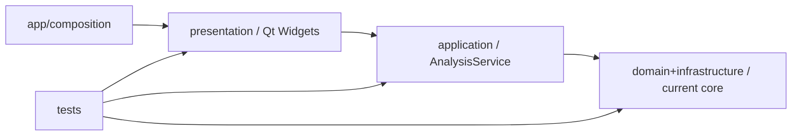
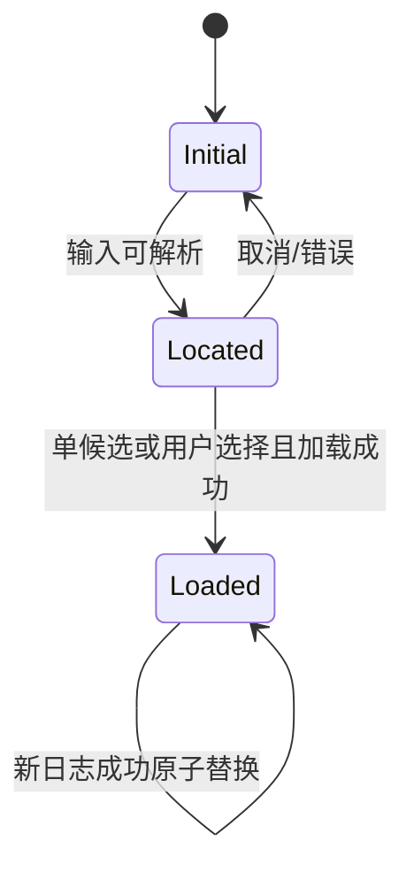
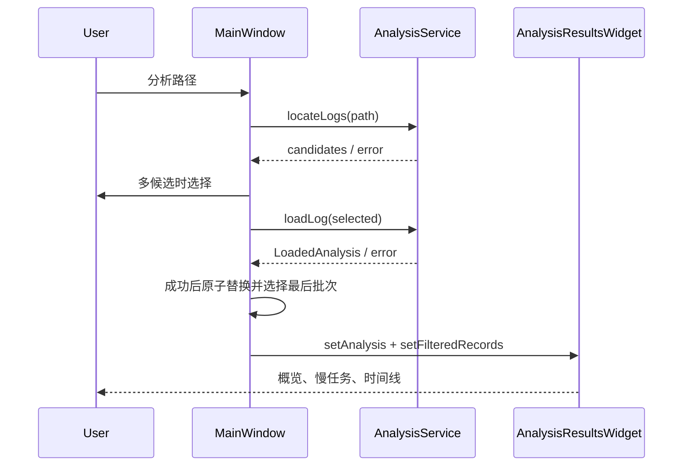

# 设计文档：Ninja 日志分析器 0.6.0 架构重构

> 阶段：design
>
> 工作流：design-first
>
> 设计深度：high
>
> 状态：已完成
>
> 最近更新：2026-07-24

## 设计摘要

- 目标：保持日志定位、v4/v5 解析、批次、指标、过滤、图表和时间线行为，按 Spec 插件 0.6.0 的模块、构建与平台交付契约重构现有 Qt Widgets 软件。
- 覆盖行为：REQ-001、REQ-002、REQ-003、REQ-004。
- 核心方案：增加 application 用例层；把主窗口中的结果页和样式拆为独立 presentation 组件；让 CMake 顶层只做工程编排；为 macOS `.app` 建立 build/install/deploy 三层产物验证。
- 模块/构建边界：ARCH-001、ARCH-002、ARCH-003；BUILD-001、BUILD-002、BUILD-003。

## 代码库调查

| 证据类型 | 证据 | 已验证事实 | 对设计的影响 |
|---|---|---|---|
| 用户 | 2026-07-23 用户要求 | 按 0.6.0 插件重构，功能差不多即可，验证后提交 GitHub | 优先结构和可交付性，不新增分析功能 |
| 版本控制 | `git status --short --branch`、`git log -1` | `main` 在 `f73b9e9`，调查时工作树干净，远端为 `qingyiz/ninja-log-analyzer` | 建独立 `codex/` 分支，最终草稿 PR |
| 结构基线 | 0.6.0 `inspect_structure.py .` | `MainWindow.cpp` 903 行；顶层 `CMakeLists.txt` 136 行并承担依赖、targets、平台兼容、安装、测试 | 拆分 presentation 页面和就近 CMake 清单 |
| 核心边界 | `src/core/*`、`tests/tst_core.cpp` | 解析和统计已在 `ninja_analyzer_core` 中且只依赖 Qt Core，核心测试 521 行 | 保持核心算法和 target 边界，不盲目重写 |
| UI 边界 | `src/gui/MainWindow.*` | `MainWindow` 同时执行文件定位、解析编排、页面构造、结果渲染、过滤和样式 | 增加 application service；结果页与样式独立 |
| 构建边界 | `CMakeLists.txt` | GUI 源码在应用与 GUI 测试中重复编译；所有 target 都由顶层声明 | 建 `ninja_analyzer_application`、`ninja_analyzer_gui` 库并下沉清单 |
| 当前开发产物 | `file`、`plutil`、`otool` 检查 `build/Ninja Log Analyzer.app` | arm64 `.app` 只有外壳，未收集 Qt frameworks/plugins，LC_RPATH 仍指向开发机 Qt | 默认 build 必须在 `bin` 中完成 Qt runtime 部署 |
| 原规格 | `.codex/specs/ninja-log-analyzer/*` 与 0.6.0 `validate_spec.py` | 功能规格已完成，但缺 0.6.0 的 ARCH/BUILD/复杂度/任务字段 | 新建重构 Spec，保留旧 Spec 作为原功能证据 |
| 交付路径回归 | `find build -maxdepth 5 -name '*.app'`、`src/app/CMakeLists.txt`、2026-07-23 用户反馈 | 当前 bundle 实际位于 `build/bin/Ninja Log Analyzer.app`；用户明确要求它直接位于 build 根目录 | 修正 macOS build-tree 精确路径并增加自动回归，不能只验证“某处存在 .app” |
| 最新交付反馈 | 2026-07-23 用户明确指出 `build/bin` 不是完整 mac 包 | 精确路径应为 `build/bin`，且 `.app` 必须包含运行所需 Qt Frameworks/plugins | TASK-006 的根级路径契约被替代；部署动作前移到 build target |
| 图标交付缺口 | 资源搜索、Info.plist、app CMake、2026-07-23 用户反馈 | 仓库无 `.icns`，Info.plist 无图标键，app target 无 bundle 资源 | 图标由 app 构建单元所有，并纳入 build/install bundle 验证 |
| 控件视觉回归 | 2026-07-24 用户截图、`AppStyle.cpp`、`AnalysisResultsWidget.cpp` | `QComboBox` 仅有外框规则，未覆盖 drop-down/down-arrow/view；通用 `QTabBar::tab` 只设置文本与底边，平台原生绘制产生黑色分隔线和灰色直角块 | presentation 模块补齐子控件样式，并用专用对象名限制结果标签规则 |

### 工具链与兼容性基线

| 项目 | 已验证值 | 证据 | 设计结论 |
|---|---|---|---|
| OS/架构 | macOS 15.7.5，Darwin 24.6.0，arm64 | `sw_vers`、`uname -srm` | required 原生交付验证为 macOS arm64 |
| CMake/Ninja/编译器 | CMake 3.27.1、Ninja 1.11.1、Apple Clang 17 | 各工具 `--version` | 保持 CMake 3.20+ 与 C++17 |
| Qt 6 | 6.4.3，prefix `/Users/qingyizhu/Qt6.4.3/6.4.3/macos`，有 `macdeployqt` | build cache、`qtpaths --qt-version`、文件探测 | Qt6 是主要构建/部署验证 Kit |
| Qt 5 | 5.15.2，prefix `/Users/qingyizhu/Qt5.15.2`，有 `macdeployqt` | build cache、`qmake -query QT_VERSION`、文件探测 | 保持 Qt5 共同 API 和构建回归 |
| 最低 macOS 基线 | Qt5 framework 的 Mach-O `minos 11.0`，Qt6 framework `minos 10.14`；旧应用未设目标而产生 `minos 15.7` | `otool -l` | 以共同 Kit 下界 macOS 11.0 为明确部署目标，并写入 bundle |

## 约束与设计原则

- 业务/技术约束：不改变 `.ninja_log` 统计口径；只读本地文件；C++17；兼容 Qt 5.15 与 Qt 6.4 的 Core/Widgets/Test API。
- 必须保持的现有模式：核心值对象和算法在 `src/core`；GUI 通过值对象展示；失败不覆盖最近成功结果；对象名保持以兼容 GUI 测试。
- 明确不采用：不引入 QML、数据库、网络、DI 框架或新的图表依赖；不重写已通过测试的 parser/analyzer；不承诺 Windows/Linux 二进制交付。

## 方案比较

| 方案 | 需求覆盖 | 优点 | 代价与风险 | 结论 |
|---|---|---|---|---|
| A：只更新 Spec/CMake，保留巨型 MainWindow | 可覆盖构建交付，不能解除 UI 职责触发器 | 修改少 | 架构契约与代码不一致，GUI 测试仍重复编译 | 否决 |
| B：application service + 独立结果页 + 模块化 CMake | 完整覆盖保持行为、边界和交付 | 依赖方向清楚，页面可独测，构建职责就近 | 文件数量增加，需要迁移 GUI 测试 | 采用 |
| C：引入完整 MVVM/插件化页面 | 完整覆盖 | 扩展性最高 | 对当前单窗口工具过度设计，改动和回归风险大 | 否决 |

### DEC-001：以最小分层重构代替框架级重写

- 上下文与需求：REQ-001、REQ-002、REQ-003。
- 决策：保留 core；新增无 Widgets 依赖的 `AnalysisService`；把 Overview、SlowTasks、Timeline 组成 `AnalysisResultsWidget`；`MainWindow` 只保留窗口壳、交互选择和 view state 协调。
- 理由：直接解除已验证的职责混合，同时复用稳定算法和现有对象名测试。
- 代价：presentation 组件之间需要少量 signal/slot 契约。
- 被否决方案：保留巨型窗口；完整 MVVM 重写。

### DEC-002：把 CMake target 图作为架构的可执行表达

- 上下文与需求：REQ-003、REQ-004。
- 决策：顶层只设置工程/Qt/CTest并 `add_subdirectory`；core、application、gui、app、tests 就近声明；兼容和交付规则放入 `cmake/*.cmake`。
- 理由：消除 GUI 源码重复编译，依赖边可由 `target_link_libraries` 审计。
- 代价：增加多个小型 `CMakeLists.txt`。
- 被否决方案：继续在顶层集中声明所有源文件和平台脚本。

### DEC-003：build-tree 直接生成自包含部署 bundle

- 上下文与需求：REQ-004。
- 决策：macOS 主交付物固定为 `<build>/bin/Ninja Log Analyzer.app`；app target 链接完成后立即使用 active Qt Kit 的 `macdeployqt` 收集运行时并验证，同时携带项目自有 `.icns` 图标。`cmake --install --prefix <stage>` 保留为完整 bundle 的安装副本；发布包、签名和公证本轮不适用。
- 理由：用户明确从 `build/bin` 取包；编译成功不等于可分发，完整依赖不能只存在于另一个 stage 目录。
- 代价：首次及重新链接 app 的构建时间和磁盘占用增加；签名仍需外部凭据。
- 被否决方案：把 bundle 内裸可执行文件当作交付物；无证据新增 DMG。

### DEC-004：以 presentation 自有资源完成跨平台控件绘制

- 上下文与需求：REQ-002 / AC-002.5。
- 决策：保留标准 `QComboBox` 和 `QTabWidget` 的行为与可访问性；在 `AppStyle` 中完整覆盖组合框 drop-down、down-arrow、popup item 与结果标签栏状态，使用 GUI target 自有的轻量 SVG chevron，结果标签规则只作用于 `QTabBar#resultTabBar`。
- 理由：最小改动即可消除平台原生样式残片，同时不改变筛选和页面切换信号。
- 代价：GUI 静态库需显式初始化一项 Qt resource；视觉快照仍需人工确认整体观感。
- 被否决方案：为两个组合框创建自绘子类；全局替换应用 `QStyle`；继续依赖平台原生箭头。

## 总体架构

### 组件与职责

| 组件 | 职责与边界 | 输入/输出 | 相关需求 |
|---|---|---|---|
| `AnalysisService` | 定位日志、只读加载、解析、manifest 分类和批次聚合；不弹对话框 | 路径或已选日志 → candidates / `LoadedAnalysis` / error | REQ-001、REQ-002 |
| `MainWindow` | 路径输入、多候选选择、批次和筛选状态、原子提交成功结果 | 用户事件 ↔ service/results widget | REQ-001、REQ-002 |
| `OverviewPage` | 摘要、分类、洞察、下钻意图 | `AnalysisResult` → signals | REQ-002 |
| `SlowTasksPage` | 虚拟表和过滤状态文案 | filtered records | REQ-002 |
| `TimelinePage` | 时间线容器、截断/泳道状态文案 | filtered records | REQ-002 |
| `AnalysisResultsWidget` | 三页面 tab 组合、专用分段标签样式入口和页面间导航 | analysis + filtered records | REQ-002、REQ-003 |
| `AppStyle` | presentation 视觉令牌、标准控件子控件样式和 UI resource 初始化 | Qt Style Sheet + `:/ninja-analyzer/ui/*` | REQ-002 |

## 模块与依赖边界

### ARCH-001：依赖只能从外层指向内层稳定契约

- 决策：`composition -> presentation -> application -> core`；tests 可以依赖被测层；core/application 禁止依赖 Qt Widgets。
- 组合根：`src/main.cpp` 创建 `QApplication`、`AnalysisService`（由 MainWindow 持有默认实例）和 `MainWindow`。
- 禁止的跨层依赖：结果页不得直接读取文件；application 不创建 Widgets；core 不引用 GUI；主窗口不直接调用 parser/manifest/analyzer。
- 边界验证方法：检查 include 与 target link 图；独立构建 `ninja_analyzer_core`、`ninja_analyzer_application`、`ninja_analyzer_gui`。

### ARCH-002：页面独立拥有自己的视图对象和渲染职责

- 决策：Overview、SlowTasks、Timeline 各自构造、更新和拥有其子控件，窗口壳只协调过滤与导航。
- 组合根：`AnalysisResultsWidget`。
- 禁止的跨层依赖：页面之间不得保存彼此指针；通过 signals 或 results widget 的窄接口通信。
- 边界验证方法：每页头文件仅暴露数据输入/查询和导航信号；GUI 测试按对象名验证行为；结果标签栏用专用对象名限定样式作用域。

### ARCH-003：加载结果是原子值对象

- 决策：`LoadedAnalysis` 拥有日志元数据、manifest、全部 records 与 batches；service 失败只返回 error，不修改窗口已有状态。
- 组合根：application module 定义值对象；MainWindow 在成功后 move 进当前状态。
- 禁止的跨层依赖：不得在 pipeline 中途逐字段写入 MainWindow；不得让结果对象持有 QWidget 或 QFile handle。
- 边界验证方法：application 单测和 GUI “失败后保留”回归。

| 模块/层 | 单一主要职责 | 公开契约/数据所有权 | 允许依赖 | 禁止依赖 | 目录/测试所有权 |
|---|---|---|---|---|---|
| core | 日志/manifest I/O 适配与领域算法 | `NinjaLogTypes`、parser/analyzer APIs | Qt Core | Widgets、application、gui | `src/core` / `tst_core` |
| application | 分析用例编排与加载结果 | `AnalysisService`、`LoadedAnalysis` | core、Qt Core | Widgets、gui | `src/application` / `tst_application` |
| presentation | 单窗口和结果页面 | Widgets、signals、只读展示接口 | application、core 值对象、Qt Widgets | parser 文件 I/O 入口 | `src/gui` / `tst_mainwindow` |
| composition | 进程启动和顶层依赖装配 | `main()` | gui、Qt Widgets | 业务规则 | `src/main.cpp` / GUI smoke |

## 构建与交付结构

### BUILD-001：模块 target 与源码所有权一一对应

- 已确认构建系统及版本：CMake 3.20+（本机 3.27.1），Ninja 可选。
- 顶层入口仅负责：project、C++ 标准、Qt 主版本发现、CTest、兼容规则加载、子目录编排。
- 模块就近声明：`src/core`、`src/application`、`src/gui`、`src/app`、`tests`。
- 可复用规则/约定插件：`cmake/NinjaAnalyzerQtCompatibility.cmake` 与 `cmake/NinjaAnalyzerDelivery.cmake`。
- 资源、安装、签名、部署/发布责任：app target 声明 bundle 元数据；delivery module 声明安装与 Qt runtime 收集；签名/发布包不适用。

### BUILD-002：PUBLIC/PRIVATE 传递与 ARCH 依赖一致

- core PUBLIC Qt Core；application PUBLIC core/Qt Core；gui PUBLIC application、PRIVATE Qt Widgets，并就近编译 presentation 自有 `.qrc`；app PRIVATE gui/Qt Widgets。
- GUI tests 链接 `ninja_analyzer_gui`，不再重复编译 GUI 源码；core/application tests 分别链接对应 target。

### BUILD-003：平台交付规则不进入模块编译清单

- macOS bundle 输出、安装、部署工具探测和 install-time 部署由 delivery module 负责；图标资源由 app target 就近声明，delivery module 只验证最终资源契约。
- Windows/Linux 只定义 build-tree executable/install runtime 的通用 CMake 语义；未在本机生成发布包。

| 构建单元/Target | 类型 | 所有模块 | 公开依赖 | 私有依赖 | 定义位置 | 验证单元 |
|---|---|---|---|---|---|---|
| `ninja_analyzer_core` | static library | core | Qt Core | 无 | `src/core/CMakeLists.txt` | core tests |
| `ninja_analyzer_application` | static library | application | core、Qt Core | 无 | `src/application/CMakeLists.txt` | application tests |
| `ninja_analyzer_gui` | static library | presentation | application | core、Qt Widgets | `src/gui/CMakeLists.txt` | GUI tests |
| `ninja_log_analyzer` | WIN32/MACOSX_BUNDLE executable | composition | 无 | gui、Qt Widgets | `src/app/CMakeLists.txt` | launch/delivery |
| test executables | executable | tests | 无 | 被测 target、Qt Test | `tests/CMakeLists.txt` | CTest |

## 平台与交付矩阵

- 目标平台集合及证据：required 为 macOS arm64（当前原生环境和旧 Spec）；Windows/Linux 保持源码兼容但不是本轮已验证交付平台。
- 开发输出根目录约定：所有平台为 `<build>/bin`；macOS 该目录中的 `.app` 是完整部署 bundle。
- 原生构建/验证环境：macOS 15.7.5 arm64；Qt 6.4.3 与 Qt 5.15.2。

| 目标平台/架构 | 开发构建物及精确路径 | 安装/部署产物 | 最终发布包 | 运行时依赖与资源 | 原生验证命令/证据 |
|---|---|---|---|---|---|
| macOS 11.0+ / arm64 | `<build>/bin/Ninja Log Analyzer.app`（自包含） | `<stage>/Ninja Log Analyzer.app` | 不适用（本轮不签名/公证/DMG） | build/install bundle 均含 Qt Frameworks、PlugIns/platforms、Info.plist、`Resources/NinjaLogAnalyzer.icns` | 全新 build；CTest；两处 `verify_delivery.py --require-self-contained`；plist/iconset 检查；build bundle 启动 smoke |
| Windows / 未确认 | `<build>/bin/Ninja Log Analyzer.exe`（设计契约） | `<prefix>/bin/...exe`（未验证） | 不适用 | DLL/plugins 未验证 | 本轮无原生 runner，明确未验证 |
| Linux / 未确认 | `<build>/bin/ninja_log_analyzer`（设计契约） | `<prefix>/bin/...`（未验证） | 不适用 | so/plugins 未验证 | 本轮无原生 runner，明确未验证 |

### macOS 应用束约束

- `.app` 根路径：主交付 `<build>/bin/Ninja Log Analyzer.app`；安装副本 `<stage>/Ninja Log Analyzer.app`。`<build>` 根目录不得存在第二份 macOS bundle。
- `Contents/Info.plist`：`CFBundleIdentifier=com.codex.ninjaloganalyzer`、显示名/可执行名、项目版本、`LSMinimumSystemVersion=11.0`、`CFBundleIconFile=NinjaLogAnalyzer.icns`。
- `Contents/MacOS/<CFBundleExecutable>`：`Contents/MacOS/Ninja Log Analyzer`，Mach-O arm64。
- Resources、Frameworks、PlugIns：`Contents/Resources/NinjaLogAnalyzer.icns` 是 app 自有资源；build/install bundle 都必须包含该图标、Qt frameworks 与 cocoa platform plugin。
- Qt/框架部署方式：使用 active Qt Kit 中已探测到的 `macdeployqt`，不能混用 Qt5/Qt6 工具。
- 签名、公证、架构和启动验证：adhoc/开发签名不作为发布签名；不公证；`file` 验 arm64；直接启动可执行并加载 demo 后受控退出作为 smoke。

## 复杂度预算与演进规则

| 维度 | 当前基线 | 边界/触发条件 | 触发后动作 | 验证方式 |
|---|---|---|---|---|
| 类/文件职责 | MainWindow 903 行且含 6 类职责 | 一个类不得同时承担页面构建、用例 I/O、多个页面渲染；生产 `.cpp` 超 500 行需职责审查 | 拆为 service/page/style；若仍超限则重开 design | `inspect_structure.py` + include 审计 |
| 模块依赖 | core 与 gui 两层，gui 直调所有 core service | 新边不得逆转 `presentation -> application -> core` 或成环 | 停止任务，更新 ARCH/target 图 | `rg #include`、CMake target build |
| 顶层构建职责 | 顶层 136 行，5 类职责 | 顶层不得新增模块源码、平台部署命令或测试 target 细节；目标 <= 45 行 | 下沉到就近清单/单责 cmake module | `inspect_structure.py`、行数/职责审查 |
| 测试所有权 | core 521 行；GUI 210 行且重复编译生产源码 | 新用例层必须有直接测试；页面行为不能只靠完整应用人工测 | 新增 application test，GUI 链接生产库 | CTest 列表与 link graph |

## 接口契约

| 接口/事件 | 请求或输入 | 响应或副作用 | 错误语义 | 兼容性 |
|---|---|---|---|---|
| `AnalysisService::locateLogs` | 用户输入路径 | 排序后的日志路径列表 | error 非空，不修改文件 | Qt5/6 Core |
| `AnalysisService::loadLog` | 单个 `.ninja_log` 路径 | `LoadedAnalysis` 完整值 | error 非空且 result 不可提交 | Qt5/6 Core |
| `AnalysisResultsWidget::setAnalysis` | 当前 `AnalysisResult` | 三页面更新完整摘要 | 空结果显示空态 | Qt5/6 Widgets |
| `setFilteredRecords` | 过滤 records | 慢任务和时间线同步、tab 数量更新 | 空集合合法 | Qt5/6 Widgets |
| overview 下钻 signals | category 或 output | 主窗口更新过滤器并导航慢任务页 | 无持久化副作用 | queued/direct 均安全 |

## 数据模型与状态

- 所有权与生命周期：`LoadedAnalysis` 由 application 构造并移交 MainWindow；`AnalysisResult`/filtered records 由 MainWindow 持有，页面复制展示所需数据。
- 一致性与并发：当前为 UI 线程同步只读加载；不引入后台线程，保留原性能边界。
- 状态转换：失败/取消是 self-transition，不替换 Loaded。

## 关键流程

## 算法与伪代码

- 解析、分类、批次和统计沿用已验证 core 算法，不在本重构修改。
- `loadLog` 顺序：parse → load manifest → classify each record → partition batches → validate non-empty → return complete value。
- 过滤仍遍历 `analysis.slowest`，先 category 后 case-insensitive output query，结果同时传给 SlowTasks/Timeline。

## 错误处理与恢复

| 失败点 | 检测 | 处理/重试 | 用户可见结果 | 恢复 |
|---|---|---|---|---|
| 路径/候选错误 | locate error | 不自动重试 | 原原因消息 | 修改路径；旧结果保留 |
| 多候选取消 | 空选择 | 非错误 | 不弹警告 | 旧结果保留 |
| parser/load 失败 | service result error | 本次不提交 | 精确错误 | 选择其他日志 |
| manifest 缺失 | manifest `found=false` | 回退分类 | diagnostics 显示 | 提供 manifest 后重载 |
| install-time 部署工具失败 | CMake install 非零 | 停止部署验证 | 命令错误 | 修复 Kit/路径后重跑，不影响源码 |

## 非功能设计

- 安全与隐私：service 仅复用只读 core；不执行日志内容、不联网、不写构建目录。
- 性能与容量：增加的 service 只移动/传递 QVector；核心 O(n)/O(n log n) 不变；10 万条测试保持 <2 秒。
- 可观测性：GUI diagnostics 保留版本、有效/忽略、manifest、批次；部署验证输出精确 bundle 路径和失败原因。
- 兼容性：所有生产代码只用 Qt5.15/Qt6.4 共同 API；AGL workaround 保留但迁入专用 module。
- 部署、迁移与回滚：无数据迁移；重构可通过单 commit revert；发布包/签名不适用。

## 正确性属性

### PROP-001：重构前后分析结果保持

- 来源：REQ-001 / AC-001.1、AC-001.2。
- 属性：对于任意现有 core 可接受的单个日志路径，service 产生的版本、记录、manifest 分类和批次与原 MainWindow pipeline 使用同一 core API 的结果一致。
- 验证：application 临时文件测试 + 现有 core 回归。

### PROP-002：失败不替换成功状态

- 来源：REQ-002 / AC-002.3。
- 属性：任意已加载状态下，定位失败、取消或加载失败后 current log/task count 保持不变。
- 验证：GUI 状态机回归。

### PROP-003：过滤的双视图一致性

- 来源：REQ-002 / AC-002.2。
- 属性：任意 category/query 组合下，慢任务表行数、timeline input 数和 tab 计数相等，完整摘要不受过滤影响。
- 验证：GUI 自动化测试。

### PROP-004：架构依赖无逆向和重复源码编译

- 来源：REQ-003 / AC-003.1、AC-003.2。
- 属性：生产 target 依赖图符合 ARCH-001，GUI 测试通过链接 `ninja_analyzer_gui` 使用生产实现而非再次列举其 `.cpp`。
- 验证：CMake 清单审查 + 各 target 独立 build。

### PROP-005：macOS 部署 bundle 自包含

- 来源：REQ-004 / AC-004.1—AC-004.4。
- 属性：部署 `.app` 具备合法 bundle 结构、arm64 主程序、Qt frameworks 和 cocoa plugin，非系统动态依赖不解析到开发机 Qt 绝对路径。
- 验证：`verify_delivery.py --require-self-contained`、`otool`、启动 smoke。

### PROP-006：macOS build bundle 路径唯一且自包含

- 来源：REQ-004 / AC-004.1。
- 属性：对于任意受支持的 macOS 单配置构建目录，构建 `ninja_log_analyzer` 后，bundle 必须位于 `<build>/bin/Ninja Log Analyzer.app`，根目录无同名副本，并包含 Frameworks、cocoa plugin 和 bundle Frameworks RPATH。
- 验证：仓库 post-build/CTest 精确检查 + 全新 `build` 目录 + `verify_delivery.py --require-self-contained` + 启动 smoke。

### PROP-007：macOS 图标资源与清单一致

- 来源：REQ-004 / AC-004.6。
- 属性：任意通过交付验证的 macOS build/install bundle，其 `CFBundleIconFile` 必须解析到 `Contents/Resources/NinjaLogAnalyzer.icns`；该文件可由 `iconutil` 展开，并包含 16、32、128、256、512、1024 像素表示。
- 验证：post-build/CTest 检查 plist 与资源存在；`iconutil --convert iconset` 检查标准层级；Finder Quick Look/图标预览作人工补充。

### PROP-008：筛选与结果导航不混入平台原生样式残片

- 来源：REQ-002 / AC-002.5。
- 属性：Qt5/Qt6 中的批次和类型组合框均引用同一可加载的自有 chevron 资源并完整覆盖 drop-down；结果 tab bar 使用 `resultTabBar` 专用圆角分段规则，切换 tab 后仅选中项使用紫色强调，原有索引和计数文本保持。
- 验证：GUI 自动化检查资源、对象名、样式规则和切换行为；Qt5/Qt6 demo 视觉快照人工复核。

## 测试策略

| 行为/属性 | 测试层级 | 关键场景 | 证据形式 |
|---|---|---|---|
| REQ-001 / PROP-001 | application + core | 单日志、manifest、错误日志、批次 | QtTest/CTest |
| REQ-002 / PROP-002/003/008 | GUI component | 成功、批次、过滤、失败保持、页面下钻、控件视觉契约 | offscreen QtTest + 双 Qt 视觉快照 |
| REQ-003 / PROP-004 | build/静态审查 | target 独立 build、include/link 方向、结构预算 | CMake build + inspect script |
| REQ-004 / PROP-005/006/007 | 原生交付 | Qt6/Qt5 build app、`bin` 精确路径、图标、build/install 自包含、启动 | CMake/CTest/verify_delivery/plist/iconutil/file/启动 smoke |

## 需求覆盖矩阵

| 行为 | 组件/接口 | 架构/构建边界 | 决策 | 正确性属性 | 测试策略 |
|---|---|---|---|---|---|
| REQ-001 | AnalysisService | ARCH-001/003、BUILD-001/002 | DEC-001 | PROP-001 | application/core |
| REQ-002 | MainWindow、Results pages、AppStyle | ARCH-002/003、BUILD-002 | DEC-001/004 | PROP-002/003/008 | GUI |
| REQ-003 | 所有 modules/targets | ARCH-001/002、BUILD-001/002 | DEC-002 | PROP-004 | build/structure |
| REQ-004 | app + delivery module | ARCH-001、BUILD-003 | DEC-003 | PROP-005/006/007 | native delivery |

## 风险与未决问题

- RISK-001：Qt5/Qt6 `macdeployqt` 输出细节不同；必须分别用当前 Kit 的工具验证，失败不降级为“编译通过”。
- RISK-002：Linux/Windows 无本轮原生 runner；只标记源码设计契约，不能标记交付已验证。
- RISK-003：拆分页面可能改变 object ownership 或信号时序；保留 objectName 并由 GUI 回归覆盖。
- RISK-004：只检查递归找到任意 `.app` 会掩盖输出目录漂移；回归必须断言 `build/bin` 精确路径和 build 根目录中不存在重复 bundle。
- RISK-005：Qt5/Qt6 与平台 style 对 QSS 子控件绘制细节不同；用自有 SVG 箭头、对象名限定规则和双 Kit 快照降低漂移。
- 当前无阻塞设计或实施的未决问题。
