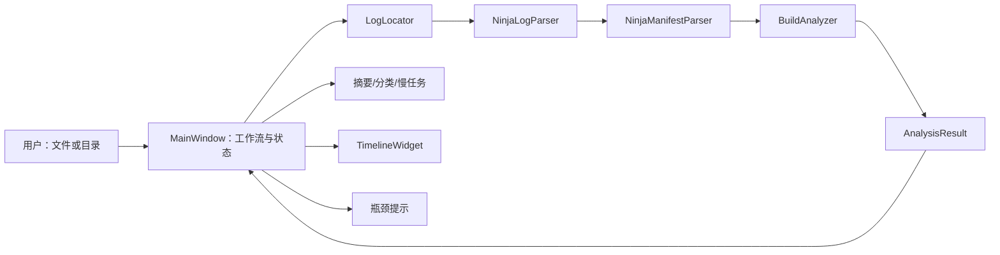
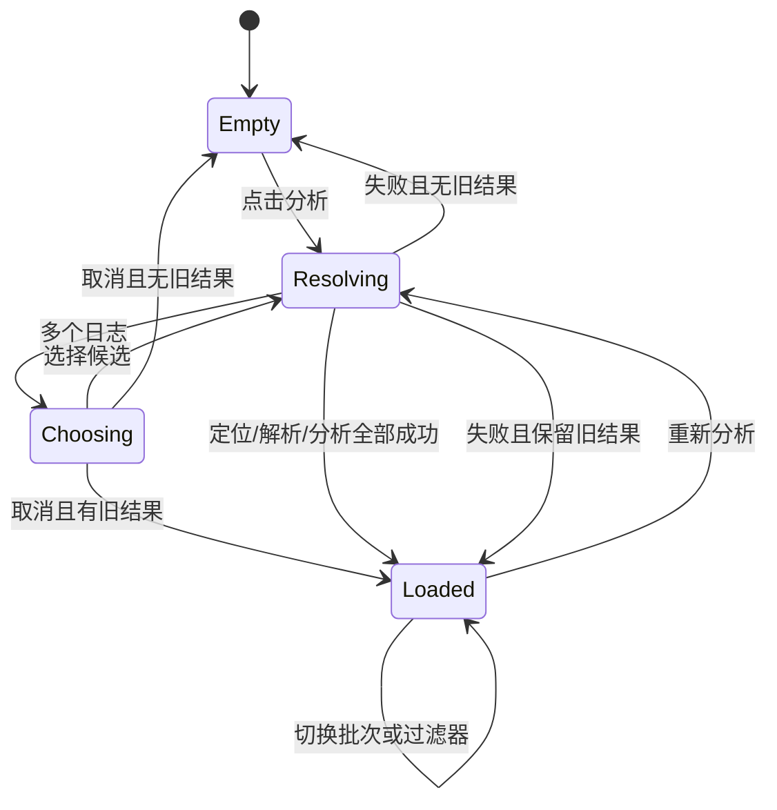
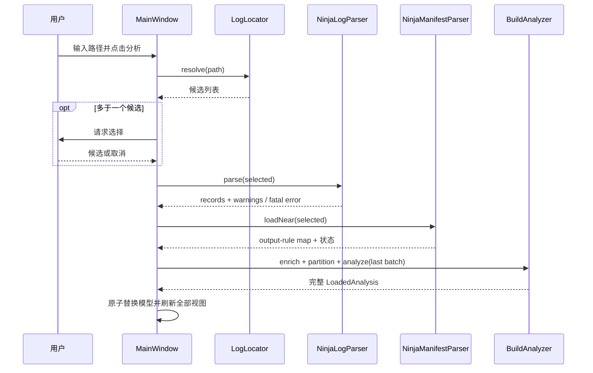

# 设计文档：Ninja 构建日志分析器

> 阶段：design
>
> 工作流：requirements-first
>
> 设计深度：high
>
> 状态：已完成
>
> 最近更新：2026-07-22

## 设计摘要

- 目标：用只依赖 Qt Core/Widgets 的跨平台桌面应用，把 `.ninja_log` 转换为可复核的批次、指标、分类、慢任务、时间线和瓶颈候选。
- 覆盖行为：REQ-001—REQ-006。
- 核心方案：分层为 `ninja_analyzer_core` 与 `ninja_log_analyzer`。核心层负责路径发现、日志解析、manifest 规则补充和纯统计；Widgets 层负责文件选择、原子加载状态、筛选和自绘可视化。

## 代码库调查

| 证据类型 | 证据 | 已验证事实 | 对设计的影响 |
|---|---|---|---|
| 仓库 | `rg --files -uu`、`git status --short --branch` | 空仓库、无提交、无现有模块/测试/构建约束 | 建立最小分层结构，不做迁移或兼容旧 API |
| 会话规范 | 用户消息中的 `AGENTS.md instructions` | 必须中文沟通；C++ 项目优先 CMake、Qt、跨平台；改动后说明验证 | 工程和文档以跨平台 API 为边界，交付时列验证 |
| 本机 | `cmake --version`、`ninja --version`、`c++ --version`、`uname` | CMake 3.27.1、Ninja 1.11.1、Apple Clang 17、macOS arm64 | CMake 最低版本不高于本机；本机是实测平台 |
| Qt Kit | Qt 6.4.3/Qt 5.15.2 查询、最小工程构建、Qt CMake 配置和 `otool -L` | 两个主版本均有 Core/Widgets/Test；Qt6 wrapper 在 Xcode 26.2 SDK 下冗余链接缺失的 AGL；Qt5 可链接 | 不采用 Qt Charts；使用共同 API；为旧 Qt6 Kit增加窄范围 CMake guard |
| Ninja 源码 | Ninja v1.11.1 官方 `src/build_log.cc` | 当前日志 v5、最低 v4、五字段、按输出保留较新记录、可能重整 | 解析 v4/v5；保留原始行；批次只能启发式推断 |
| Ninja 手册 | 官方 manual 的 Build statements / The Ninja log | build statement 暴露 output→rule，日志位于 build root 或 `builddir` | 通过邻近 `build.ninja` 补充 rule，缺失即回退 |
| 样本 | 仓库内查找 `.ninja_log` | 没有用户样本 | 添加合成 demo 和临时文件测试，不把特定 rule 当事实 |

### 工具链与兼容性基线

| 项目 | 已验证值 | 证据 | 设计结论 |
|---|---|---|---|
| OS/架构 | macOS Darwin 24.6.0 arm64 | `uname -srm` | 本轮实测 macOS；代码不得使用 Cocoa 私有 API |
| C++/构建 | Apple Clang 17、CMake 3.27.1、Ninja 1.11.1 | 版本命令 | 使用 C++17、AUTOMOC、CTest；不依赖 C++20 |
| Qt | Qt 6.4.3 macOS、Qt 5.15.2 desktop | Kit 查询与实际链接 | `find_package(QT NAMES Qt6 Qt5 ...)`；Qt6 在 AGL SDK 库缺失时过滤 `WrapOpenGL` 的显式 AGL 项；两版完整验证 |
| 图表依赖 | Qt6 有 Charts，Qt5 未探测到 Charts | 包文件检查 | 为双版本和部署一致性，图表由 `QPainter` 自绘 |

## 约束与设计原则

- 业务/技术约束：只读本地分析；不运行 Ninja；不上传；日志失败不清空最近成功结果；统计口径必须可见。
- 必须保持的现有模式：仓库无既有模式；采用标准 CMake target 分层与 Qt parent ownership。
- 明确不采用：Qt WebEngine/浏览器前端、Python 运行时、数据库、`ninja -t recompact`、把启发式批次称为精确会话、解析完整 Ninja DAG。

## 方案比较

| 方案 | 需求覆盖 | 优点 | 代价与风险 | 结论 |
|---|---|---|---|---|
| A：Qt Widgets + C++ 核心 + QPainter 自绘 | 完整覆盖 REQ-001—006 | 启动轻、离线、Qt5/6 共同 API、核心易测、无额外运行时 | 自绘时间线需要维护布局和命中测试 | 采用 |
| B：Qt WebEngine + HTML/JS 图表 | 可覆盖 REQ-001—006 | 图表生态丰富、样式灵活 | WebEngine 体积大，本机 Kit 状态未验证，Qt5/6 部署复杂，跨语言测试成本高 | 否决 |
| C：调用 ninjatracing/脚本后展示结果 | 部分覆盖 REQ-002—005 | 可复用已有转换逻辑 | 引入外部可执行/运行时，错误与格式受外部版本控制，不满足独立 C++ 核心目标 | 否决 |

### DEC-001：核心与 Widgets 分层，兼容 Qt6/Qt5

- 上下文与需求：REQ-001—REQ-006，NFR-003、NFR-006。
- 决策：建立静态核心库，仅链接 Qt Core；应用目标链接 Core/Widgets；测试链接 Core/Test。CMake 用 `QT_VERSION_MAJOR` 选择目标。
- 工具链兼容：在 Apple + Qt6 + `WrapOpenGL::WrapOpenGL` 存在且 SDK 中找不到 AGL 时，过滤该 imported target 中匹配 AGL 的显式链接项；其他平台、Qt5 或可找到 AGL 时不改变依赖。
- 理由：解析统计可在无 GUI 环境测试，Widgets 层保持薄；兼容已验证的两套 Qt。
- 代价：数据对象必须避免 Widgets 类型；不能直接在核心中生成图表对象；旧 Qt6 Kit 的兼容 guard 需要通过 Qt5/Qt6 双构建防回归。
- 被否决方案：所有代码放入 `MainWindow`；会让算法难测且 UI 状态与解析耦合。

### DEC-002：保守解析并保留诊断，不因单行失败放弃全文件

- 上下文与需求：REQ-002、NFR-002。
- 决策：严格校验签名/版本；数据行按前四个制表符切分，最后字段保留剩余字节；单行验证失败记录 `ParseWarning` 后跳过。v5 最后字段必须是十六进制，v4 保留命令字段并标记非 v5 哈希。
- 理由：与 Ninja v1.11.1 `Load/WriteEntry` 契约一致；兼容 v4 命令字段内潜在制表符；正在写入的尾行不应毁掉其余分析。
- 代价：坏行不参与统计，结果必须显示忽略数。
- 被否决方案：对 `QString::split('\t')` 后要求恰好五项；会误拒绝 v4 最后字段中含制表符的记录。

### DEC-003：批次是显式标注的启发式视图

- 上下文与需求：REQ-003、REQ-006，FACT-007。
- 决策：按有效行顺序扫描；`current.endMs < previous.endMs` 时切分。默认最后批次，同时提供全量视图。数据模型和界面统一使用“推断批次”。
- 理由：同一 Ninja 运行的命令在完成时追加，结束时间应非递减；回退是新运行的实用信号。
- 代价：日志重整后顺序可能不再表示运行，无法恢复真实会话；全量时间线可能混合多个相对时间轴。
- 被否决方案：按输出 mtime 或日志文件时间恢复会话；现有字段不足以可靠重建。

### DEC-004：manifest 只做 output→rule 的容错补充

- 上下文与需求：REQ-003，Ninja build statement 契约。
- 决策：从日志目录向上最多四级寻找 `build.ninja`；合并 `$` 续行；解析 `build` 行中冒号前的显式/隐式输出及冒号后的首个 rule；支持 `$ `、`$:`、`$$` 转义，并对不含变量的相对 `include/subninja` 做有界递归。匹配失败按扩展名/路径分类。
- 理由：输出到 rule 足以显著改善 CMake 生成规则的分类，不必执行外部 Ninja 或实现完整解释器。
- 代价：包含变量的 include、动态输出、罕见转义可能无法匹配；必须显示回退状态。
- 被否决方案：实现完整 Ninja parser/DAG；首版复杂度和回归面远超用户目标。

### DEC-005：统计使用完整当前视图，过滤只影响明细和时间线

- 上下文与需求：REQ-004、REQ-005。
- 决策：选择批次后计算不可变 `AnalysisResult`；摘要与分类基于完整结果。搜索/类型过滤生成明细索引，仅更新慢任务表和时间线，并在 UI 标注“汇总未过滤”。
- 理由：过滤时摘要不跳变，用户可对照全局瓶颈并定位明细；避免同一指标随 UI 筛选产生歧义。
- 代价：用户不能在首版查看某过滤子集的独立总体统计。
- 被否决方案：所有指标随搜索即时重算；统计口径不稳定且更易误读。

### DEC-006：新结果构造成功后再提交 UI 状态

- 上下文与需求：REQ-001、REQ-006。
- 决策：`loadPath()` 在局部变量中依次定位、解析、补充、分析；全部成功才替换 `MainWindow` 的当前模型并刷新控件。错误/取消仅弹出说明。
- 理由：自然满足“失败保留最近成功结果”，无需复杂回滚。
- 代价：加载期间有一份临时数据和一份旧数据，短时内存增加 O(n)。
- 被否决方案：边解析边清空/更新表格；中途失败会留下半成品界面。

### DEC-007：时间线全量统计、限量绘制

- 上下文与需求：REQ-005、NFR-001、RISK-004。
- 决策：统计处理全部记录；时间线在过滤结果超过 5000 时选取耗时最长 5000 条，再按开始时间布局。泳道用“最早可复用 lane end”分配，命中矩形用于 tooltip。
- 理由：长任务是瓶颈定位的优先对象，限制绘制/命中对象可保持交互。
- 代价：超大日志的时间线不呈现全部短任务；界面必须显示截断数量。
- 被否决方案：一次创建数万 QWidget/QGraphicsItem；对象数量和布局成本高。

## 总体架构



### 建议目录结构

```text
CMakeLists.txt
README.md
src/
  core/NinjaLogTypes.h
  core/LogLocator.{h,cpp}
  core/NinjaLogParser.{h,cpp}
  core/NinjaManifestParser.{h,cpp}
  core/BuildAnalyzer.{h,cpp}
  gui/MainWindow.{h,cpp}
  gui/TimelineWidget.{h,cpp}
  main.cpp
tests/tst_core.cpp
examples/demo-build/.ninja_log
examples/demo-build/build.ninja
```

### 组件与职责

| 组件 | 职责与边界 | 输入/输出 | 相关需求 |
|---|---|---|---|
| `LogLocator` | 校验文件输入、递归查找日志、稳定排序 | path → paths/error | REQ-001 |
| `NinjaLogParser` | 只读解析 v4/v5、验证字段、保留警告/行号 | log path → `ParseResult` | REQ-002 |
| `NinjaManifestParser` | 定位 manifest、解析 output→rule、规范化匹配 | log path + records → `ManifestInfo` | REQ-003 |
| `BuildAnalyzer` | 批次切分、分类、指标、聚合、排序、提示 | records + rule map + view → `AnalysisResult` | REQ-003—005 |
| `MainWindow` | 输入、候选选择、原子状态提交、批次/过滤、状态说明 | 用户事件 ↔ 核心结果 | REQ-001、REQ-005、REQ-006 |
| `TimelineWidget` | 限量泳道布局、自绘坐标和条形、tooltip | 过滤记录 + 类别颜色 | REQ-005 |

## 接口契约

| 接口/事件 | 请求或输入 | 响应或副作用 | 错误语义 | 兼容性 |
|---|---|---|---|---|
| `LogLocator::resolve(path)` | 文件或目录字符串 | 规范化绝对 `.ninja_log` 列表 | `Result.error`，不抛跨 UI 异常 | Qt5/6 Core |
| `NinjaLogParser::parse(path)` | 可读日志路径 | `ParseResult{version, records, warnings}` | 致命错误与行级警告分离 | v4/v5 |
| `NinjaManifestParser::loadNear(logPath)` | 日志路径 | manifest 路径、rule map、警告 | 缺失是非致命状态 | 常见 Ninja build statement 子集 |
| `BuildAnalyzer::partition(records)` | 有效记录 | 非空 `BuildBatch` 列表 | 空输入返回空列表 | 确定性 |
| `BuildAnalyzer::analyze(records)` | 当前视图记录 | 指标、分类、排序、提示 | 空输入返回零值和空集合 | 确定性、无 Widgets |
| `TimelineWidget::setRecords(records)` | 已分类记录 | 更新布局并重绘 | 空集合绘制空态 | Qt5/6 Widgets |

## 数据模型与状态

```cpp
enum class StepCategory { CCompile, CxxCompile, CudaCompile, QtAutogen,
                          Resource, StaticLink, SharedLink, ExecutableLink,
                          CustomCommand, Other };
enum class ClassificationSource { ManifestRule, OutputHeuristic };

struct NinjaLogRecord {
    qint64 startMs, endMs, mtime;
    QString output, commandField, rule;
    int sourceLine;
    bool hasV5Hash;
    quint64 commandHash;
    StepCategory category;
    ClassificationSource classificationSource;
};
struct ParseWarning { int line; QString message; };
struct ParseResult { int version; QVector<NinjaLogRecord> records; QVector<ParseWarning> warnings; };
struct BuildBatch { int firstRecord; int recordCount; qint64 minStartMs, maxEndMs; };
struct CategoryStats { StepCategory category; int count; qint64 totalMs, maxMs; double averageMs, share; };
struct AnalysisResult { SummaryMetrics summary; QVector<CategoryStats> categories;
                        QVector<NinjaLogRecord> slowest; QVector<Insight> insights; };
```

- 所有权与生命周期：核心返回值由 `MainWindow` 值语义持有；Qt 子控件使用 parent ownership；没有裸 owning pointer。
- 一致性与并发：首版同步只读加载；只有完整的局部 `LoadedAnalysis` 才替换当前状态。10 万条性能目标允许同步实现，不引入线程跨对象生命周期风险。
- 状态转换：



## 关键流程



## 算法与伪代码

### 日志解析

```text
read first line; match exactly "# ninja log vN"
reject N not in {4, 5}
for each following physical line:
  strip LF and one optional CR
  find first four TAB positions; if any missing => warning, continue
  parse start/end/mtime using checked 64-bit conversion
  validate start >= 0, end >= start, output non-empty
  if v5: parse remaining field as checked base-16 unsigned 64-bit
  append record with physical source line
if no valid record => fatal error
```

### manifest 输出映射

```text
find build.ninja in log dir, then up to 4 parents
parse file once using canonical-path visited set and max-file guard
join lines ending in unescaped '$'
for build statement:
  find first unescaped ':'
  tokenize escaped output segment; ignore '|' marker but include outputs on both sides
  first token after ':' is rule
  normalize each output and map to rule
for literal include/subninja:
  resolve relative to declaring manifest and recurse
for each log record:
  try normalized raw output, then output relative to manifest dir
  matched => categoryFromRule(rule)
  unmatched => categoryFromOutput(output)
```

### 指标与并发

```text
minStart = min(start); maxEnd = max(end); window = maxEnd - minStart
total = sum(end - start)
averageParallelism = window > 0 ? total / window : 0
events = [(start,+1),(end,-1)] for duration > 0
sort by (time asc, delta asc)  // -1 before +1
active = max(0, active + delta); maximum = max(maximum, active)
group records by category and derive count/total/average/max/share
sort slowest by (duration desc, output asc, sourceLine asc)
```

### 瓶颈提示

- 总是给出累计任务时间最高的类别和占比（数据集非空）。
- 总是给出最慢任务及其绝对耗时和观察窗口占比（观察窗口为 0 时只给绝对值）。
- 当 `maxParallelism >= 2` 且 `averageParallelism < 0.5 * maxParallelism` 时，给出“并行分布不均候选”；当记录至少 4 且 `averageParallelism < 1.5` 时，给出“整体串行候选”。提示不推断 CPU 核数。
- 计算任务耗时 P90；若任务结束位于观察窗口最后 10%，且耗时至少 `max(1000ms, P90)`，给出最多 3 个“尾段长任务候选”。

## 错误处理与恢复

| 失败点 | 检测 | 处理/重试 | 用户可见结果 | 恢复 |
|---|---|---|---|---|
| 路径不存在/无日志 | `QFileInfo/QDirIterator` | 不重试 | 对话框说明路径或无候选 | 修改路径再分析；旧结果保留 |
| 多候选取消 | 选择返回空 | 不视为错误 | 无错误弹窗 | 保持旧状态 |
| 签名/版本/空有效记录 | parser fatal result | 停止本次流水线 | 精确原因 | 选择其他日志 |
| 单行损坏 | checked parse | 跳过并收集警告 | 状态显示忽略数量，详情 tooltip/对话框 | 修复日志或继续分析 |
| manifest 缺失/解析不足 | manifest 状态/警告 | 回退输出分类 | 状态标“输出推断” | 提供正确 build.ninja 后重载 |
| 时间线过多 | 数量阈值 | 取最慢 5000 | 显示“已绘制 x/y” | 使用搜索/类型过滤 |

## 非功能设计

- 安全与隐私：只使用 `QFile::ReadOnly`；不执行从日志或 manifest 读取的字符串；不向构建目录写文件；UI 输出使用 Qt 文本组件而不是 HTML 注入。
- 性能与容量：核心扫描和聚合 O(n)，分类哈希查找均摊 O(1)，慢任务排序 O(n log n)，事件排序 O(n log n)，内存 O(n)。目录发现使用迭代器，不读取非目标文件。
- 可观测性：状态区显示绝对日志路径、格式版本、有效/忽略数、推断批次数、manifest/回退状态、时间线截断数。
- 兼容性：仅使用 Qt 5.15/6.4 共同 API；路径统一经 `QDir::fromNativeSeparators/cleanPath`；Windows 匹配键使用大小写折叠；CMake 不硬编码本机 Qt 路径。
- 工具链兼容边界：AGL guard 不伪造框架或改写 Qt 安装，只去除 Qt6 wrapper 的冗余应用级链接项；若 QtGui 自身在目标系统无法加载，其问题仍应作为 Kit 不兼容暴露。
- 部署、迁移与回滚：新仓库无迁移；构建产物与源代码分离。回滚可移除新增目标/文件，不触及用户构建数据。

## 正确性属性

### PROP-001：有效记录解析保持字段与顺序

- 来源：REQ-002 / AC-002.1、AC-002.5。
- 属性：对于任意合法 v4/v5 数据行序列，解析结果条数和顺序与输入有效行一致，且每条 start/end/mtime/output/最后字段与输入语义一致。
- 验证：表驱动单元测试，覆盖 LF/CRLF、空格路径、v4/v5。

### PROP-002：坏行隔离

- 来源：REQ-002 / AC-002.2、AC-002.3，NFR-002。
- 属性：在任意合法记录序列中插入有限个坏行，只增加对应警告并保持其他合法记录的解析值和相对顺序不变。
- 验证：示例测试与循环插入测试。

### PROP-003：批次分区完整且不重不漏

- 来源：REQ-003 / AC-003.1、AC-003.2。
- 属性：对于任意非空记录序列，推断批次按原顺序连接后等于原序列，每个记录恰属一个批次，且批次内 endMs 非递减。
- 验证：性质化循环测试和边界示例。

### PROP-004：分类来源可追溯

- 来源：REQ-003 / AC-003.3—AC-003.5。
- 属性：任意记录若命中 manifest output map，则规则和分类来源为 ManifestRule；否则来源为 OutputHeuristic，且一定得到一个枚举分类。
- 验证：manifest 解析/回退表驱动测试。

### PROP-005：统计守恒

- 来源：REQ-004 / AC-004.1、AC-004.2。
- 属性：任意非空当前视图中，各类别 count 之和等于任务数，各类别 totalMs 之和等于累计任务时间；累计时间非负，观察窗口非负。
- 验证：构造重叠、零耗时、重复输出的单元测试。

### PROP-006：并发扫描不产生负值且最大值正确

- 来源：REQ-004 / AC-004.1、AC-004.4。
- 属性：对任意非负区间集合，事件扫描过程 active 不小于 0，所得最大并行度等于任意半开区间 `[start,end)` 同时覆盖数量的最大值。
- 验证：边界示例 + 小规模穷举时间点对照。

### PROP-007：慢任务排序确定

- 来源：REQ-004 / AC-004.3。
- 属性：任意记录集合的慢任务结果按耗时非增序；相同耗时按 output、sourceLine 排序，重复分析结果一致。
- 验证：排序单元测试。

### PROP-008：失败不替换成功 UI 状态

- 来源：REQ-001 / AC-001.3、AC-001.4，REQ-006 / AC-006.3。
- 属性：已存在成功 `LoadedAnalysis` 时，任意定位取消或后续流水线错误均不修改当前模型标识和摘要。
- 验证：将加载构造函数/函数结果注入 MainWindow 的 GUI 逻辑测试或人工回归；核心错误路径由单元测试覆盖。

### PROP-009：时间线泳道不重叠

- 来源：REQ-005 / AC-005.2、AC-005.5。
- 属性：布局后的任意同泳道正时长任务，其半开时间区间互不相交；绘制记录数不超过 5000。
- 验证：抽取纯布局函数单元测试 + GUI 人工检查。

## 测试策略

| 行为/属性 | 测试层级 | 关键场景 | 证据形式 |
|---|---|---|---|
| REQ-001 | 核心单元 | 文件、空目录、嵌套单/多日志、错误路径、稳定排序 | QtTest |
| REQ-002 / PROP-001/002 | 核心单元 | v4/v5、CRLF、空格、v5 坏哈希、截断尾行、无有效记录 | QtTest 临时文件 |
| REQ-003 / PROP-003/004 | 核心单元 | 时间回退、多输出 build、转义空格、manifest 缺失、rule/扩展分类 | QtTest |
| REQ-004 / PROP-005/006/007 | 核心单元 | 重叠、相邻、零耗时、类别守恒、稳定慢任务 | QtTest + 穷举对照 |
| REQ-005 / PROP-009 | 核心/组件/人工 | 提示阈值、泳道、过滤、空态、截断状态 | QtTest + GUI 冒烟/截图 |
| REQ-006 / PROP-008 | 组件/人工 | 初始态、成功、失败保留、关于口径、1280×760 | GUI 冒烟与人工检查 |
| NFR-001 | 性能 | 合成 100000 条 v5 记录，Release 解析+统计 | 计时测试（宽松 CI 阈值 2s） |
| NFR-003/004 | 构建 | Qt6 完整构建测试；Qt5 configure/build（若 Kit 可用） | CMake/CTest 日志 |

## 需求覆盖矩阵

| 行为 | 组件/接口 | 决策 | 正确性属性 | 测试策略 |
|---|---|---|---|---|
| REQ-001 | `LogLocator`、`MainWindow::loadPath` | DEC-001、DEC-006 | PROP-008 | 路径单元 + GUI 回归 |
| REQ-002 | `NinjaLogParser::parse` | DEC-002 | PROP-001、PROP-002 | parser 单元测试 |
| REQ-003 | `partition`、`NinjaManifestParser`、classifier | DEC-003、DEC-004 | PROP-003、PROP-004 | batch/manifest/classifier 测试 |
| REQ-004 | `BuildAnalyzer::analyze` | DEC-005 | PROP-005、PROP-006、PROP-007 | analyzer 单元测试 |
| REQ-005 | `AnalysisResult`、`TimelineWidget`、过滤器 | DEC-005、DEC-007 | PROP-006、PROP-009 | 算法测试 + GUI 冒烟 |
| REQ-006 | `MainWindow` 状态机、关于对话框 | DEC-006 | PROP-008 | GUI/人工检查 |

## 风险与未决问题

- RISK-001（批次误判）：通过术语、状态说明和关于对话框持续提示；获得真实日志后复核。
- RISK-002（manifest 子集）：解析警告与回退分类可观测；不让补充信息阻塞基本分析。
- RISK-003（性能根因过度推断）：洞察只描述日志可证明的耗时/并行现象。
- RISK-004（大数据绘制）：限量 5000，完整统计不截断。
- 当前无阻塞实现的未决问题。
